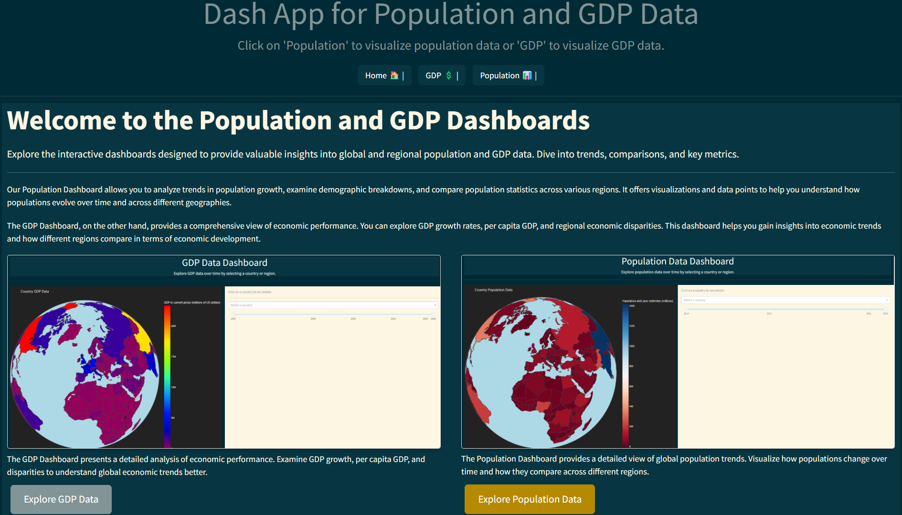
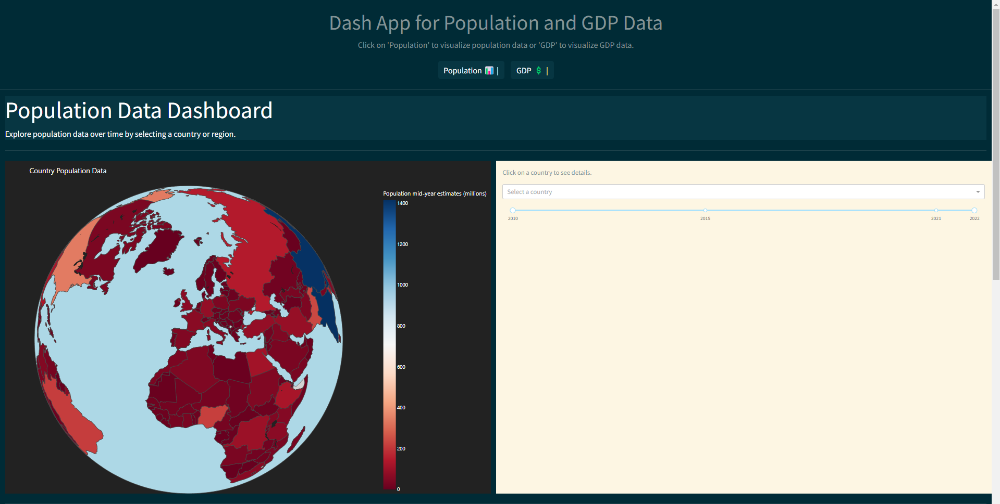
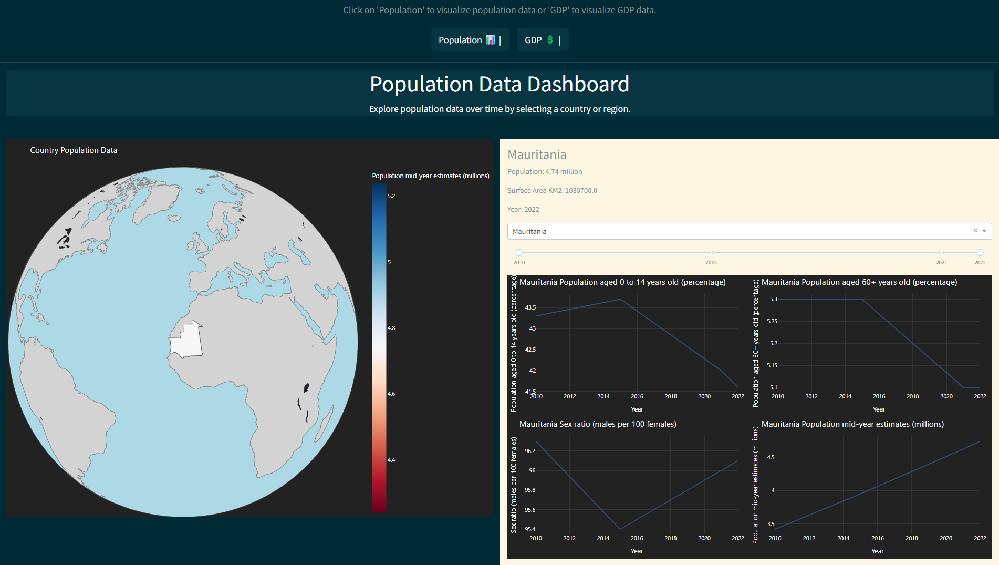
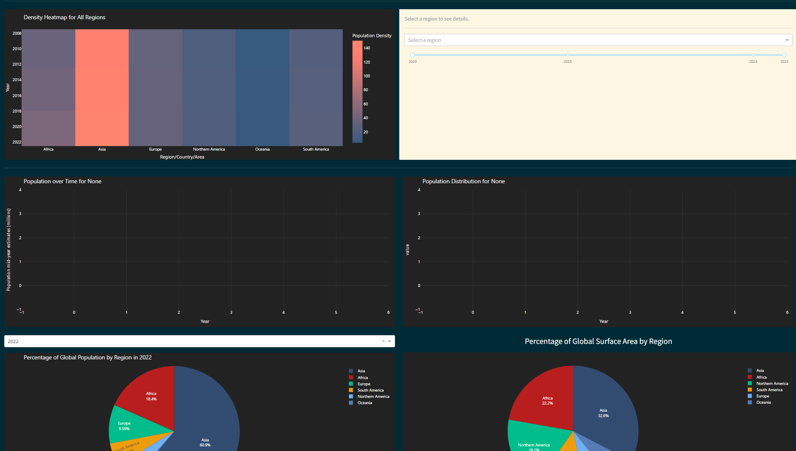
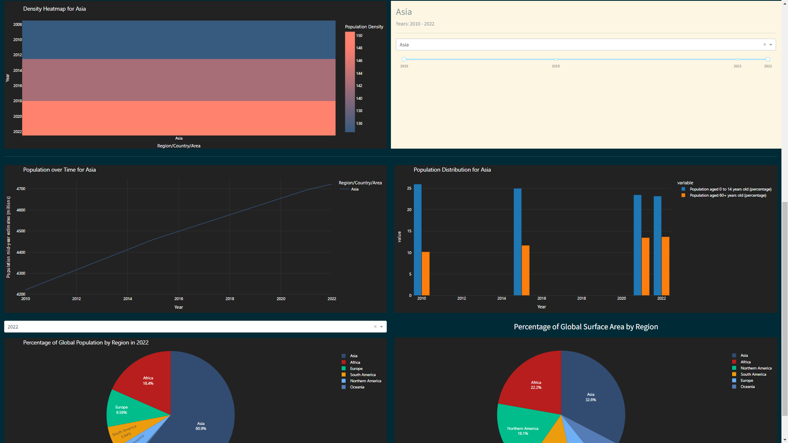
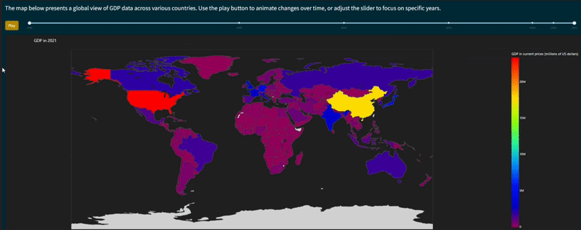
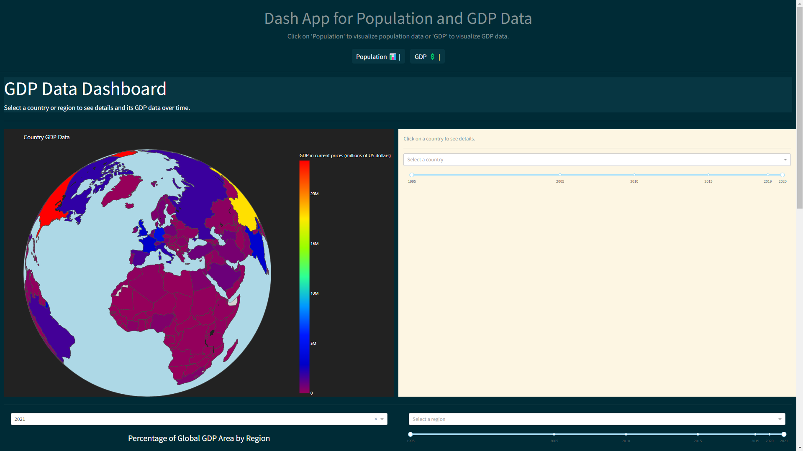
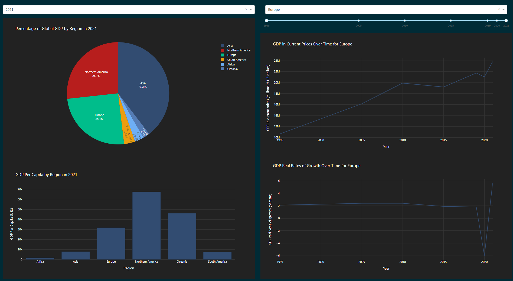
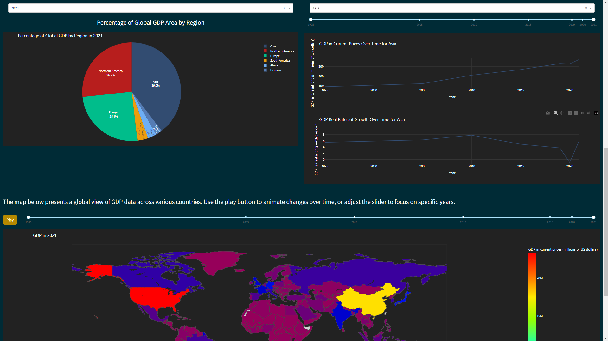

# Population and GDP Data Visualization Dashboard



This repository contains a multi-page Dash web application designed to visualize population and GDP data interactively. The app provides insights into demographic trends, economic indicators, and geographic distributions through interactive maps and various types of charts. It is deployed on Heroku and PythonAnywhere.

## Table of Contents

1. [Features](#features)
2. [Deployment](#deployment)
3. [Installation and Setup](#installation-and-setup)
4. [Data Sources](#data-sources)
5. [Structure of the Repository](#structure-of-the-repository)
6. [Screenshots](#screenshots)

## Features

- **Interactive Dashboards**: Explore population and GDP trends by country and region interactively.
- **Geospatial Visualization**: Utilize interactive maps to visualize population density and GDP distribution.
- **Multi-page Application**: Navigate between different sections dedicated to population and GDP data. 
- **Deployment**: Accessible online via Heroku and PythonAnywhere.

## Deployment

The application is deployed on both Heroku and PythonAnywhere. You can access it at the following locations:

- [Heroku](https://dash-app1-3836e5244b0e.herokuapp.com/)
- [PythonAnywhere](https://tourad.pythonanywhere.com/)

**Note:** When accessing the app for the first time, figures may take up to 1-2 minutes to load. Reloading the page after this initial delay will ensure the figures appear correctly.
## Installation and Setup

To run this application locally:

1. Clone this repository:
   ```bash
   git clone https://github.com/TouradBaba/exploratory_data_analysis_and_visualization.git
   ```

2. Install dependencies:
   ```bash
   pip install -r requirements.txt
   ```

3. Run the application:
   ```bash
   python app.py
   ```
   Open [http://127.0.0.1:8050/](http://127.0.0.1:8050/) in your web browser to view the app.

## Data Sources

- Population Data: [UN Data - SYB66_1_202310_Population, Surface Area and Density](https://data.un.org/_Docs/SYB/CSV/SYB66_1_202310_Population,%20Surface%20Area%20and%20Density.csv)
- GDP Data: [UN Data - SYB66_230_202310_GDP and GDP Per Capita](https://data.un.org/_Docs/SYB/CSV/SYB66_230_202310_GDP%20and%20GDP%20Per%20Capita.csv)
- Land Area Data: [Our World in Data - Land Area](https://ourworldindata.org/grapher/land-area-km)

## Structure of the Repository

- `jupyter_notebooks/`: Contains Jupyter notebooks used for data exploration and analysis.
- `assets/`: Stores some screenshots and the Solar theme from [Bootswatch](https://bootswatch.com/).
- `data/`: Holds cleaned and processed datasets used by the application.
- `pages/`: Includes Python scripts defining different pages of the Dash app.
- `.gitattributes`: Git attributes configuration file.
- `.gitignore`: Git ignore configuration file.
- `Procfile`: Heroku configuration file specifying the application server.
- `app.py`: Main Python file defining the Dash application and its layout.
- `requirements.txt`: List of Python dependencies required to run the application.
- `runtime.txt`: Specifies the Python runtime version used by the application.

## Screenshots

### 1-Population Page

**This image displays a map showing population data worldwide.**


**This image displays a map showing population data when a specific country is selected.**



**This image includes a heatmap and additional figures related to population data.**



**This image shows a heatmap and related figures specifically when a region is selected.**




### 2-GDP Page

**This animated GIF visualizes how GDP varies across countries over different time periods.**



**This image displays a map showing GDP data worldwide.**



**This image presents a map displaying GDP data when a specific country is selected.**




**This image shows additional visualizations and figures related to GDP data.**


